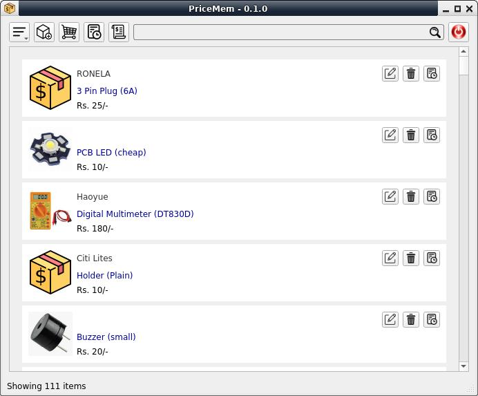
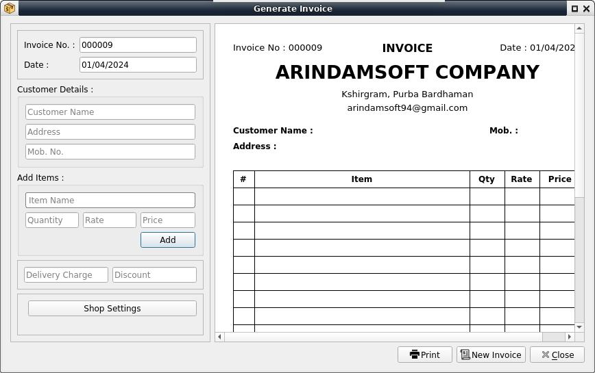

# PriceMem
A product price management tool for small shop business.  

### Description

I run a small business, where I have difficulties with remembering price of some products.  
So I created this app.

With this app you can -  
* Save each product details (sell price, cost price, photo, brand, description).  
* View purchase history for each product.  
* View purchase history datewise for all products.  

### Download
Download the precompiled packages from [releases page](https://github.com/ksharindam/pricemem/releases).  
For Linux download .AppImage package, mark it executable, and double click to run.  

### Installation

If you wan to install using pip, first install these dependencies...  

* python3  
* python3-pyqt5  
* pytqt5-dev-tools (to compile resources)  

Then inside data/ dir, exec compile_rc. The resource file will be generated.  

Then inside project root directory, run following command..  
`$ sudo pip3 install .`  

To uninstall run..  
`$ sudo pip3 uninstall pricemem`    

### Usage

To run after installing, type command..  
`$ pricemem`  

If you want to run the program without/before installing, then  
Open terminal and change to project root directory and run  
`$ ./pricemem.py`  

### Screenshots

  

  

  

